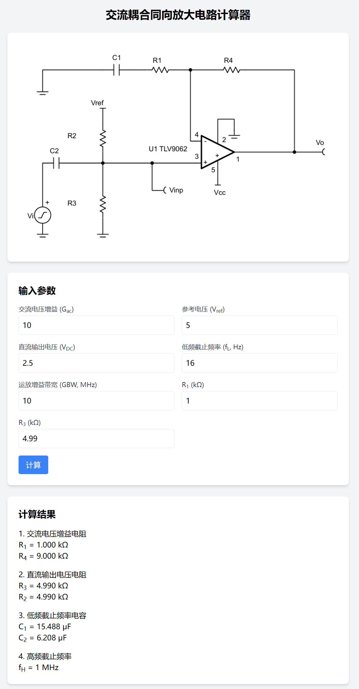

# 交流耦合同向放大电路计算器

这是一个基于Vue3和Tailwind CSS构建的交流耦合同向放大电路参数计算器，可帮助电子工程师快速计算电路中的关键元件参数。

## 功能特性

- 计算交流电压增益电阻(R1, R4)
- 计算直流输出电压电阻(R2, R3) 
- 计算低频截止频率电容(C1, C2)
- 计算高频截止频率(fH)
- 自动匹配标准元件值
- 智能单位转换(kΩ/Ω/mΩ, μF/nF/pF)

## 在线演示

访问在线版本: [https://createskyblue.github.io/AC_CoupledNonInvAmpCalculator/](https://createskyblue.github.io/AC_CoupledNonInvAmpCalculator/)

## 使用说明

1. 输入电路参数：
   - 交流电压增益(Gac)
   - 参考电压(Vref)
   - 直流输出电压(VDC)
   - 低频截止频率(fL)
   - 运放增益带宽(GBW)
   - R1和R3值(可选)

2. 点击"计算"按钮获取结果

3. 结果包含：
   - 计算值
   - 自动转换的单位
